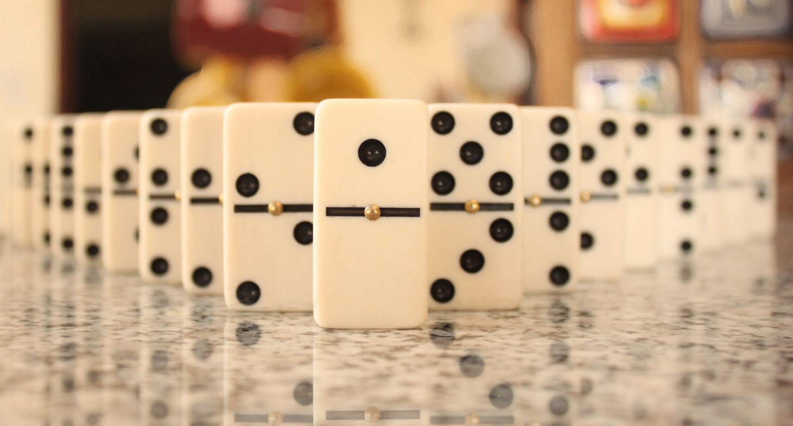
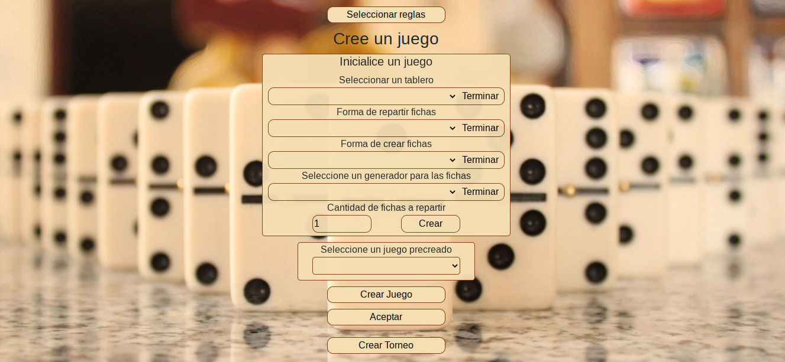
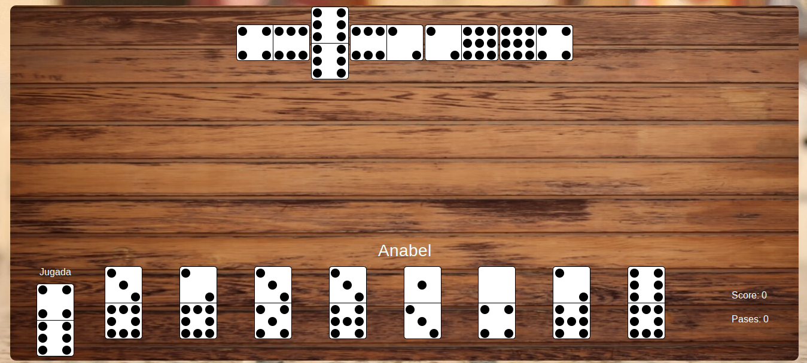
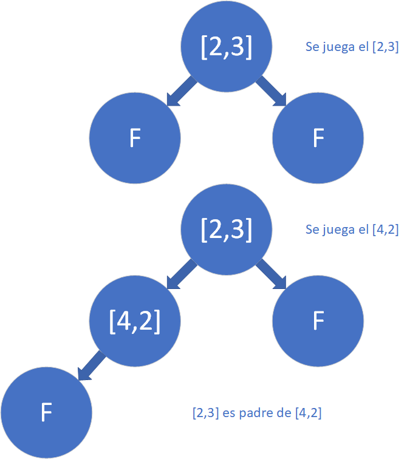
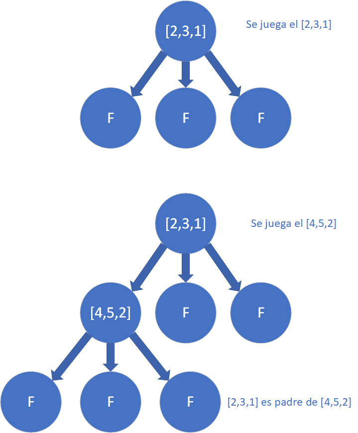
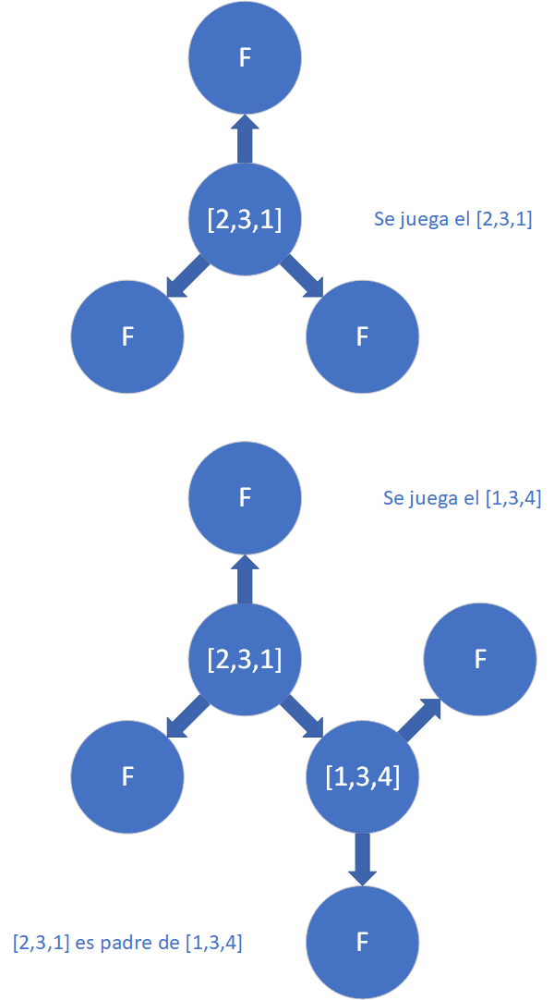

# N-OMINO



> Proyecto de Programación II.

> Facultad de Matemática y Computación - Universidad de La Habana.

> Curso 2022.

> Anabel Benítez González C-211

> Raudel Alejandro Gómez Molina C-211

Este proyecto se basa en simular variantes del popular juego _Dominó_ (que en esta versión desarrollada en _MATCOM_ denominaremos _N-OMINO_) y su desarrollo, mediante la interacción de jugadores virtuales. Las variaciones más notables que se aprecian en el proyecto son la forma de las fichas del juego y la forma en la que estas se ubican en el tablero, además de las estrategias de los jugadores virtuales y las reglas que estos deben seguir.

Al usuario se le brinda la posibilidad de configurar un juego totalmente nuevo, pero siempre manteniendo algunas ideas básicas del juego original, además de ofrecer juegos pre creados con algunas variantes clásicas de _Dominó_ y otras que suponen su invención en este proyecto. También se le permite al usuario configurar las estrategias de los distintos jugadores que participan durante la ejecución del juego, las cuales se rigen por las pautas del juego tradicional.

Dada la variedad de opciones con que cuenta el usuario para configurar y simular el juego, lo invitamos a probar las diferentes implementaciones de este y a descubrir las diversas maneras de jugar al _N-OMINO_, unas pueden tener sentido otras no, pero todas cuentan con la imaginación y creatividad que surgen de extender el popular juego del _Dominó_.

## Interfaz Gráfica

La interfaz gráfica se está diseña en Blazor, un framework de C# para el desarrollo web, la misma consta de dos partes, la primera permite configurar y diseñar el juego y la segunda muestra el desarrollo visual del mismo y la interacción de los jugadores virtuales que participan en este.

### Diseño y Creación del Juego



Al inicio de la configuración se le muestra al usuario primeramente un menú donde se elige el tipo que se va a estar utilizando en el juego.

Configurar un torneo:

- Dependiendo del tipo anteriormente seleccionado se muestra un componente genérico donde es posible configurar las reglas del torneo y la cantidad de variantes de juego con que este va a contar.

- Reglas del torneo, se subdividen en un menú más interno donde es posible la cantidad de reglas por cada tipo de regla así como sus distintas implementaciones y las condiciones bajo las cuales estas actúan, además es posible seleccionar un total de 3 reglas pre creadas con implementaciones clásicas de un torneo de dominó, que se le facilitan al usuario. Algunas de estas reglas cuentan con implementaciones que se deben elegir por defecto, por lo que será necesario escoger en algunas ocasiones una implementación de más con respecto a la cantidad de condiciones.

- Crear un juego, en este apartado se brinda la posibilidad de añadir varios juegos al torneo y configurar cada uno de estos atendiendo a la conveniencia del usuario.

Crear un Juego:

- Configurar un juego, este menú cuenta con la posibilidad de elegir las variantes para desarrollar el juego de `N-OMINO`, permitiendo seleccionar las reglas del juego, el tablero, la cantidad de fichas a repartir, la forma de generar y repartir dichas fichas y la cantidad de fichas que se le reparte a cada

  jugador.

- Seleccionar las reglas de un juego, aquí se permite seleccionar la cantidad de reglas a utilizar por cada tipo de regla, así como la posibilidad de escoger las implementaciones y las condiciones bajo las cuales estas se ejecutan, algunas de estas reglas cuentan con implementaciones que se deben elegir por defecto, por lo que será necesario escoger en algunas ocasiones una implementación de más con respecto a la cantidad de condiciones.

- Juegos pre creados, se le muestra la posibilidad al usuario de seleccionar varios juegos pre creados con varias variantes clásicas de dominó y otras variantes de `N-OMINO`, creadas en el proyecto.

Una vez terminada la configuración de crea un objeto `BuildGame<T>`, el cual contiene todo lo necesario para desarrollar un juego.

Crear los Jugadores:

- Para crear los jugadores, es preciso definir un nombre para cada jugador así como el número del equipo al cual pertenece este.

- Luego se le muestra la posibilidad al usuario de configurar como debe actuar su jugador, para ello es necesario seleccionar el número de estrategias del jugador y las condiciones bajo las que estas se ejecutan, además se debe escoger una estrategia por defecto que el jugador usará cuando no estén disponibles las anteriores.

Una vez configurados estos parámetros, se crea el objeto `JudgeTournament<T>`, el cual contiene todo lo referente para el desarrollo del torneo. Posteriormente, botón `Comenzar`, ejecuta una llamada al método asíncrono `Start`, el cual arranca la ejecución del torneo.

Nota: Dada la variedad de opciones y de juegos que se pueden simular, pueden presentarse en ocasiones juegos con ciclos infinitos, así como la combinación de situaciones que pueden no tener sentido dentro de las pautas del juego tradicional. Por lo que se deja en responsabilidad del usuario el uso adecuado del juego.

### Desarrollo Visual del Juego



Desde lo Lógico:

- Para mostrar el desarrollo del juego se utiliza desde lo lógico el objeto `Printer`, el cual ejecuta un evento cada vez que ocurre un cambio en el juego, el cual se comunica con un método ubicado en el proyecto de Blazor.

- Al método suscritos en el proyecto de Blazor se le pasa un objeto de tipo `IEnumerable<LocationGui>`, el cual contiene la ubicación por filas y columnas de cada una de las fichas ubicadas en el tablero, así como su respectivo tipo y la información obtenida del método `ToString` de cada elemento contenido en los índices de la ficha.

```CS

public static void ExecuteTableEvent(IEnumerable<LocationGui> location)
{
    BindTableEvent!(location);
}

public static void ExecuteHandEvent(IEnumerable<LocationGui> location, LocationGui? play, string action, InfoPlayerGui player)
{
    BindHandEvent!(location, play, action, player);
}

```

- Cada tipo de mesa cuenta con una implementación distinta de `Printer`, las cuales se ajustan a las características de la mesa y permiten usar la misma implementación de la interfaz gráfica para cada una de estas variaciones.

Desde lo Visual:

- El componente `GameGui`, cuenta con la implementación de la mesa y la mano del jugador para el aparatado visual, mediante los componentes `TableGui` y `HandPlayer`, respectivamente.

- El componente `TokenTypes` contiene una implementación distinta de la forma y estructura de la ficha, dependiendo del tipo que posea esta, el cual es proporcionado por `Printer`.


- La distribución de las fichas en la pantalla se realiza mediante **CSS-Grid**, dándole la ubicación a cada ficha dependiendo de las filas y columnas que se especifiquen en el objeto `LocationGui`, proporcionado por `Printer`.

## Token
La ficha es la unidad básica del dominó, consta de cierta cantidad de caras a las cuales se le asigna un determinado valor. 
``Token<T>`` implementa IEnumerable<T>
### Aspectos del diseño a tener en cuenta

Para diseñar la estructura de mesa se optó por variar las caras de las fichas de dominó, de ahí el nombre del proyecto `N-OMINO`.

- `TableDimension`, dada la estructura con que cuenta esta mesa, no se encontró método para representarla gráficamente, por lo que se recurrió a imprimir directamente la ficha en la pantalla, sin tener en cuenta las conexiones de dicha ficha.

- `TableGeometry`, en esta mesa solo se optó por las estructuras de 3, 4 y 6 caras, ya que el ángulo interior de las respectivas figuras debe ser divisor de $360^0$. Entonces sea $n$ la cantidad de lados de la ficha, luego: $${(n-2)\cdot 180 \over n}= {360\over k}$$ $$ k={2n\over n-2}$$ $$\Rightarrow n-2 | 2n\Rightarrow n-2|4$$ $$\Rightarrow n=3 \vee n=4 \vee n=6$$

  por tanto la estructura antes mencionada solo se puede lograr con fichas de 3, 4 y 6 caras respectivamente.

## INode

## Estructura de la mesa

La mesa está estructurada en forma de grafo, en la clase abstracta `TableGame<T>`, cuyos nodos están representados en la interface `INode<T>`. El funcionamiento de la mesa se basa, en la expansión de los nodos cuando se juega una ficha por ellos, donde cada implementación de `TableGame<T>` redefinirá una expansión de sus nodos.

Características Generales:

- `TableGame<T>` cuenta con las propiedades, `HashSet<INode<T>> PlayNode`, `HashSet<INode<T>> FreeNode` y `List<INode<T>> TableNode`, las cuales contienen, los nodos por los que se ha jugado, los nodos libres (representan nodos por donde se puede jugar) y los nodos que han sido creados hasta ahora, respectivamente.

- El método `PlayTable`, es el encargado de interactuar con el juego y recibir una ficha y el respectivo nodo, por el que se quiere jugar la ficha, una vez hecho esto se llama al método `Expand`, el cual se encarga de expandir la mesa. A dicho nodo se le asigna la ficha y sus respectivos valores en las conexiones, mediante la propiedad `ValuesConnection`, así como sus padres (que representan los nodos vecinos al actual, que contenían una ficha). Una vez hecho esto se retira el nodo de `FreeNode` y pasa a formar parte de `PlayNode`.

- El método `Expand` crea nuevos nodos, según como esté predeterminada la distribución del grafo, los asigna a `FreeNode` y a `TableNode`, los cuales pasarían a ser nodos por donde se puede jugar.

- El método `Clone` se encarga de devolver una copia del estado actual de la mesa, para realizar esta copia se simulan las jugadas hechas en la mesa, mediante el historial llevado en `TableNode`.

- El método `Reset` se encarga de devolver una mesa vacía del mismo tipo de la actual.

Implementaciones:

- `TableDimension<T>`, esta mesa posee una dimensión $n$, la cual será el número de caras con que cuentas sus fichas, los nodos con los que cuenta la mesa `NodeDimension<T>`, cuentan con $n$ conexiones, cada una apuntando hacia otro nodo. Luego cada vez que un jugador juegue por algún nodo este creará sus $n$ conexiones siempre y cuando estas no existan.

- `TableLongana<T>` hereda de `TableDimension<T>`, y cambia su forma de expandirse, ya que su primer nodo cuenta con la misma cantidad de conexiones que jugadores en el juego, en el resto de los nodos se comporta de la misma manera que `TableDimension<T>`.

- `TableGeometry<T>`, esta clase abstracta posee una tabla de coordenadas, las cuales se distribuyen en el objeto `Coordinates`. Los nodos de esta mesa pertenecen a la clase `NodeGeometry<T>`, la cual además de sus conexiones, contiene a un objeto `Coordinates`, con las respectivas coordenadas del nodo. Luego cada vez que se juega por un nodo, este se expande hacia sus coordenadas vecinas, siempre y cuando estas no estén ocupadas por otro nodo.

- `TableHexagonal<T>` es una implementación de `TableGeometry<T>`, la cual se basa en expandirse geométricamente en forma de hexágonos.

- `TableTiangular<T>` es una implementación de `TableGeometry<T>`, la cual se basa en expandirse geométricamente en forma de triángulos.

- `TableSquare<T>` es una implementación de `TableGeometry<T>`, la cual se basa en expandirse geométricamente en forma de cuadrados.

## Funcionamiento de la mesa

Analicemos el funcionamiento de la mesa para un tablero `TableDimension<T>` de 2 caras:



- Primero se juega la ficha [2,3], se crean dos nodos libres que representan las conexiones de [2,3] por donde es posible jugar (los nodos F representan los nodos libres).
- Luego se juega el [4,2], por la conexión izquierda de [2,3], se crean sus conexiones y se asignan a los nodos libres (aquí solo se crea una sola conexión ya que la otra es el nodo que contiene al [2,3], la cual ya estaba predeterminada.

Analicemos el funcionamiento de la mesa para un tablero `TableDimension<T>` de 3 caras:



- Primero se juega la ficha [2,3,1] se crean conexiones de [2,3,1] por donde es posible jugar (los nodos F representan los nodos libres).
- Luego se juega el [4,5,2], por la conexión izquierda de [2,3,1], se crean sus conexiones y se asignan a los nodos libres (aquí solo se crean 2 conexiones ya que la otra es el nodo que contiene al [2,3,1], la cual ya estaba predeterminada.

Analicemos el funcionamiento de la mesa para un tablero `TableGeometry<T>` de 3 caras:



- Primero se juega la ficha [2,3,1] se crean conexiones de [2,3,1] por donde es posible jugar (los nodos F representan los nodos libres), dependiendo de las coordenadas específicas, del nodo que se expandió.
- Luego se juega el [4,5,2], por la conexión que se encuentra en la posición 270^0, con respecto al nodo de [2,3,1], se crean sus conexiones y se asignan a los nodos libres (aquí solo se crean 2 conexiones ya que la otra es el nodo que contine al [2,3,1], la cual ya estaba predeterminada.

Nota: Aquí es posible que un nodo cuente con más de un padre, ya que cuando se juega una ficha por un nodo pueden existir varias conexiones de este que cuenten con una ficha asignada.


## Reglas

Para tener un juego más versátil, no quisimos quedarnos solo con una regla de cada tipo, entonces creamos la clase abstracta `ActionConditionRule<T1, T2>` que en sus propiedades tiene un array del tipo de regla y un array de `ICondition<T>` , la posición i-ésima de las reglas se activa con la condición de la posición i-ésima de `Conditions`, esta clase también cuenta con una regla que siempre está activa `Default`.

El método `RunRule` recibe los datos del torneo, el estado del juego clonado, el estado del juego original, las reglas y el índice del jugador al que le corresponde jugar; en este se analiza el ambiente del juego y se determina qué reglas se van a utilizar.

```cs

public abstract class ActionConditionRule<T1, T2>
{
    /// Acciones que determinan las reglas
    public T1[] Actions { get; protected set; }

    /// Criterios bajo los cuales se ejecutan las reglas
    public ICondition<T2>[] Conditions { get; protected set; }

    /// Regla que se ejecuta por defecto
    public T1? Default { get; }

    public ActionConditionRule(IEnumerable<T1> rules, IEnumerable<ICondition<T2>> condition, T1? rule)
    {
        this.Actions = rules.ToArray();

        this.Condition = condition.ToArray();

        this.Default = rule;
    }

    /// Determinar la regla a utilizar
    public abstract void RunRule(TournamentStatus tournament, GameStatus<T2> game, GameStatus<T2> original, InfoRules<T2> rules, int ind);
}

```

### `ICondition<T>`

El método `RunRule` de `ICondition<T>` recibe el estado del torneo, el estado del juego, las reglas con las que se juega y el índice del jugador al que le toca jugar, en cada implementación este método revisa si actualmente se cumple o no la condición.

```cs

public interface ICondition<T>
{
    public bool RunRule(TournamentStatus tournament, GameStatus<T> game, InfoRules<T> rules, int ind);
}

```
Algunas implementaciones de condiciones son:
- ``ClassicWin<T>``: determina si el jugador actual gana la partida por tranque.
- ``CantToPass<T>`` : revisa si la cantidad de pases del jugador actual es igual a la cantidad de pases que se especifica en la regla.
- ``CantToPassTeam<T>`` : revisa si la cantidad de pases del equipo del jugador actual es igual a la cantidad de pases que se especifica en la regla.
- ``InmediatePass<T>`` : determina si el jugador actual tiene un pase inmediato.
- ``Condition Default<T>`` : siempre devuelve true.
- ``NoValidPlay<T>`` : determina si todos los jugadores no tienen jugadas válidas.
- ``HigherThanScoreHandCondition<T>`` : comprueba si el jugador actual tiene una mano con una puntuación mayor a la especificada en la regla.
- ``PostRoundCondition<T>`` : determina si el jugador actual le ha tocado jugar una cantidad mayor de veces que la especificada en la regla.
- ``CantGamesTournament<T>`` : revisa si la cantidad de partidas jugadas es igual a la cantidad de partidas que se especifica en la regla.

## Torneo

Un torneo se desarrolla en la clase `JudgeTournament<T>` que recibe en su constructor una lista de juegos, una lista de jugadores con los equipos a que pertenecen y las reglas con que se jugará dicho torneo. El método `TournamentGame()` es el encargado de ejecutar el torneo, este mientras no se cumpla la condición de finalización del torneo, prepara y ejecuta los juegos recibidos.

```cs

    public void TournamentGame()
    {  
        int ind = 0;
        // Determinar cuando finaliza un torneo
        while (!EndTournament())
        {
            for (int i = 0; i < this._games.Count; i++)
            {
                GameStatus<T> aux = _games[i].Initializer.StartGame(new List<(int, int, string)>());
                PreGame(ind, aux, i);
                List<(int, int, string)> playerTeams = this._tournament.DistributionPlayers!;
                
                //Preparar los jugadores para usar en el juego
                List<Player<T>> players = new List<Player<T>>();
                for (int j = 0; j < playerTeams.Count; j++)
                {
                    players.Add(this._playersPlay[playerTeams[j].Item2]);
                }
                
                _games[i] = _games[i].Reset();
                
                GameStatus<T> init = this._games[i].Initializer.StartGame(playerTeams);
                
                //Desarrollar un juego
                
                Judge<T> judge = new Judge<T>(this._tournament, this._games[i].Rules, init, players,
                
                this._games[i].Print);
                
                judge.Game();
                // Analizar las reglas a ejecutar despues del juego
                PostGame(ind, i, init);
                
                Printer.ExecuteMessageEvent($"El equipo + {this._tournament.ImmediateWinnerTeam} + ha ganado el actual juego");
                
                if (EndTournament()) break;

                ind++;  
                _games[i] = _games[i].Reset();
            }
        }
            
        Printer.ExecuteMessageEvent($"El equipo + {this._tournament.TeamWinner} + ha ganado torneo");
    }

```

### Reglas del Torneo

- PlayerGame : determina los jugadores que participan en el juego
- ScorePlayerTournament : se encarga de asignar puntos a los jugadores en el torneo
- DistributionPlayer : su función es determinar la distribución de los jugadores en el 
- TeamsGame : decide los equipos que participan en cada juego. Este aspecto tiene una única implementacón hasta el momento, pero se puede implementar más adelante un torneo todos contra todos o por rondas.
- ScoreTeamTournament : se encarga de asignar puntos a un equipo en el torneo. Puede ser la variante clásica de sumar las manos de los contrarios o la cantidad de puntos que acumularon los miembros del equipo.
- WinnerTournament : determina quién gana el torneo, puede ser el equipo que más puntos acumule o el equipo que más juegos ganó o el equipo que tiene al jugador que más puntos obtuvo.


### Estado del torneo

La propiedad `_tournament` de tipo `TournamentStatus` contiene la información del torneo: información de los jugadores, distribución de los equipos, las puntuaciones de los equipos, los equipos y jugadores que continúan en el torneo.

## Juego

Un juego ocurre en el método `Game()` de la clase `Judge<T>`, este consiste en un ciclo mientras no se cumpla la condición de finalización del juego manda a jugar al jugador correspondiente en el `TurnPlayer`, en el método `PrePlay` se comprueba si el jugador puede jugar con las reglas activas, si no lo pasa directo. En `PlayPlayer` se pasa al jugador una copia del estado del juego y una copia de las reglas (no dándole acceso a los original se protege de posibles trampas) y se pide al jugador su jugada `Move<T>` que consiste en una ficha, el nodo del tablero por donde se desea jugar y el validador de esta jugada, posteriormente se comprueba si la jugada es válida y de serlo se quita la ficha de la mano del jugador.

```cs
    public void Game()
    {
        int i = StartGame();
        
        while (!EndGame())
        {
            if (i == this._infoGame.Turns.Length) i = 0;
            
            //Clonar el estado del juego
            GameStatus<T> copy = this._infoGame.Clone();
            InfoRules<T> rulesCopy = this._judgeRules.Clone();
            
            bool play = PrePlay(copy, i);
            
            PlayPlayer(play, copy, rulesCopy, i);
             
            // Determinar las reglas despues de ejecutar la Move
            PostPlay(i);
            
            i++;
        }
        
        Printer.ExecuteMessageEvent(_infoGame.Players[_infoGame.FindPLayerById(this._infoGame.PlayerWinner)].Name + " ha ganado");
    }
```

#### Reglas del juego

La propiedad `_judgeRules` de tipo `InfoRules<T>` guarda las reglas del juego, estas son instancias de la clase correspondiente a cada regla específica que hereda de la mencionada clase abstracta `ActionConditionRule<T1, T2>`. Donde los elementos de `T1[] Actions` son implementaciones de las siguientes interfaces:

- IValidPlay<T>: se encarga de validar la jugada del jugador, dado un nodo, una ficha y la mesa. Algunas implementaciones como ValidPlayDimension, ValidPlayGeometry y ValidPlayLongana tienen como propiedad un comparador, el cual dado dos valores dice si son iguales o no según un criterio. Tambien tenemos la implementación ComodinToken que permite jugar la ficha comodin que se le pase en el constructor por cualquier parte. Algunas implementaciones diferentes de comparador son comparador de enteros por congruencia módulo n; comparador por máximo común divisor (mcd), ambos enteros deben tener como mcd un n que se pasa al constructor.

- IVisibilityPlayer': su función consiste en determinar la visibilidad que tienen los jugadores sobre el estado del juego, por ejemplo, si un jugador puede ver las manos de los demás jugadores o no. Contamos con las implementaciones que permiten al jugador ver las manos de su equipo y la de no ver ninguna de las demás manos. También se puede ocultar parcialmente las manos de los demás jugadores. Este control de la visibilidad se realiza vaciando las propiedades que se desean ocultar de la copia del estado del juego que se va a pasar al jugador.

- IStealToken': es el encargado de determinar las condiciones bajo las cuales el jugador puede robar una ficha.

- IToPassToken : se encarga de determinar las condiciones bajo las cuales el jugador puede pasar con ficha.

- ITurnPlayer : determina la distribución de los turnos de los jugadores. Contamos con la implementación clásica, uno que invierte el orden de los jugadores y otro que repite al jugador actual.

- IAssignScoreToken : se encarga de asignar la puntuación a cada ficha. De esta decidimos que haya solamente una variante en un juego, pues de no ser así el jugador botagorda perdería el sentido. Se puede asignar la clásica sumando los valores, por el máximo valor de sus caras.

- IAssignScorePlayer : asigna una puntuación a cada jugador. Implementamos un asignador clásico que suma el score de cada ficha, el AssignScoreHandsSmallCant que beneficia a aquel que tiene la menor cantidad de fichas en la mano y el AssignScoreHandsHighCant que beneficia a aquel que tiene la mayor cantidad de fichas en la mano. Para calcular el score de una ficha se utiliza un IAssignScoreToken. Tenemos también un asignador que otorga puntos si la suma de los nodos libres es múltiplo de 5.

- IWinnerGame : determina el ganador del juego. Puede ser el que tenga las mayor puntuación, el que tenga la menor puntuación, el que pertenezca al equipo que más puntos tiene.

- IBeginGame : su funcionalidad es determinar quién inicia el juego, puede ser el que tenga una ficha específica o el que haya ganado el juego anterior.

La combinación de estas reglas con las condiciones permite crear una gran variedad de juegos, algunos sin mucho sentido pero otros muy interesantes.


## Añadir nuevas implementaciones de reglas

- Para añadir nuevas implementaciones, se debe seleccionar una de las interfaces con que se ha extendido el dominó, las cuales se encuentran en la biblioteca de clases **Rules** y hacer una nueva implementación de la interface seleccionada.

- Posteriormente debe ubicar el nombre de la nueva clase en la clase **Select** correspondiente a la interface elegida, en dicha clase debe colocar el objeto concreto de su implementación, así como el nombre y la descripción.

- Para crear una nueva forma de mostrar el juego en pantalla, se debe hacer una nueva implementación de la clase `Printer`, en dependencia de la mesa que se esté usando.

- Para crear una nueva forma de representar una ficha desde el apartado visual, se debe crear un nuevo componente con la nueva implementación y agregarlo a `TokenTypes`, además de añadir el nuevo tipo de ficha en `Printer`.


#### Estado del juego

La propiedad `_infoGame` de tipo `GameStatus<T>` contiene toda la información que se necesita del juego: información de los jugadores, distribución de los equipos, la mesa, los valores de las fichas con que se está jugando (en un `ReadOnlyCollection<T>` para proteger de posibles cambios en el juego) y las fichas fuera de la mesa. Cuando se le pasa al jugador la información del juego, depende de la regla de visibilidad con que se esté jugando, se oculta o no información al jugador, como las manos de los otros jugadores y las fichas fuera del juego.

## Jugadores

`Player<T>` sigue la misma dinámica de las reglas, tiene un array de `IStrategy<T>` y un array de `ICondition<T>` que permite decidir bajo qué condiciones se desea jugar con dicha estrategia (ej: quiero ser botagorda si tengo más de 25 puntos en la mano). También cuenta con una `IStrategy<T>` por defecto que es la que jugará si no se cumple ninguna condición.

`IStrategy<T>` es una interface, cuyo método `Play` recibe las jugadas posibles, el estado del juego, las reglas y el id del jugador y devuelve un `IEnumerable<Move<T>>` con las mejores jugadas para dicha estrategia, ordenadas de mayor a menor.

El jugador también tiene una instancia del delegado `MoveScorer` que se encarga de otorgarle una puntuacién a una jugada, este scorer recibe la jugada que debe evaluar, el IEnumerable<Move<T>> devuelto por cada estrategia activa, las reglas y el estado del juego.

El método `Play` de `Player<T>` puntúa con el `movescorer` todas las jugadas posibles del jugador y se queda con la que obtuvo mayor puntuación. De esta manera se puede crear muchos tipos de jugadores probando distintas estrategias, condiciones y scorers.

Se tomó la decisión de que el jugador no tuviera su mano, ni tuviera acceso al juego original para evitar trampas, por esta razón cada vez que se le pide jugar lo que se le pasa al método ``Play`` son copias del estado del juego y de las reglas.
